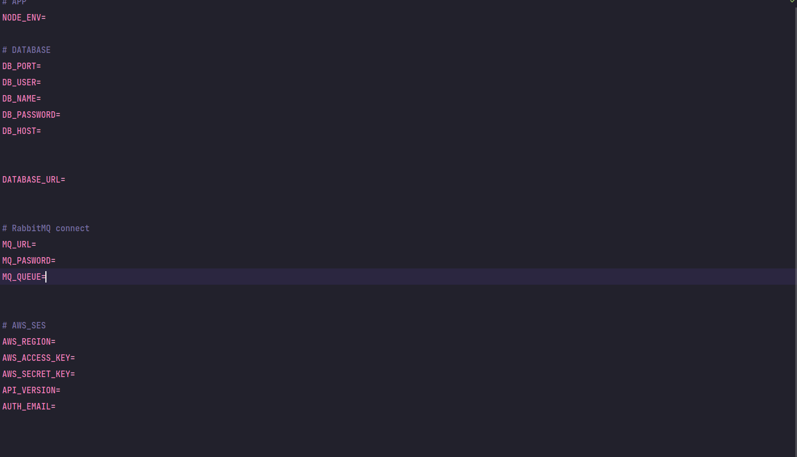

  

[circleci-image]: https://img.shields.io/circleci/build/github/nestjs/nest/master?token=abc123def456
[circleci-url]: https://circleci.com/gh/nestjs/nest

  
A progressive <a href="http://nodejs.org" target="_blank">Node.js</a> framework for building efficient and scalable server-side applications.

    

  
    
  

  <!--
  -->

## Description

Nest is a framework for building efficient, scalable <a href="http://nodejs.org" target="_blank">Node.js</a> server-side applications. It uses modern JavaScript, is built with <a href="http://www.typescriptlang.org" target="_blank">TypeScript</a> (preserves compatibility with pure JavaScript) and combines elements of OOP (Object Oriented Programming), FP (Functional Programming), and FRP (Functional Reactive Programming).

Under the hood, Nest makes use of <a href="https://expressjs.com/" target="_blank">Express</a>, but also, provides compatibility with a wide range of other libraries, like e.g. <a href="https://github.com/fastify/fastify" target="_blank">Fastify</a>, allowing for easy use of the myriad third-party plugins which are available.

## Philosophy

In recent years, thanks to Node.js, JavaScript has become the “lingua franca” of the web for both front and backend applications, giving rise to awesome projects like <a href="https://angular.io/" target="_blank">Angular</a>, <a href="https://github.com/facebook/react" target="_blank">React</a> and <a href="https://github.com/vuejs/vue" target="_blank">Vue</a> which improve developer productivity and enable the construction of fast, testable, extensible frontend applications. However, on the server-side, while there are a lot of superb libraries, helpers and tools for Node, none of them effectively solve the main problem - the architecture.

Nest aims to provide an application architecture out of the box which allows for effortless creation of highly testable, scalable, loosely coupled and easily maintainable applications. The architecture is heavily inspired by Angular.

## Stay in touch

- Author - [Kamil Myśliwiec](https://twitter.com/kammysliwiec)
- Website - [https://nestjs.com](https://nestjs.com/)
- Twitter - [@nestframework](https://twitter.com/nestframework)

## License

Nest is [MIT licensed](LICENSE).

## How to start

- This project use nestjs, prisma and RabbitMQ
- You need to create a connection with RabbitMQ
- Run migrate with prisma migrate
- Create a topic "send-email" and "create-user"
- Create a producer for populate the topics
- Connect AWS-SES creadentils or use local implementation

### Run

`npm run start:dev`
